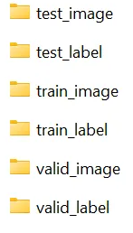
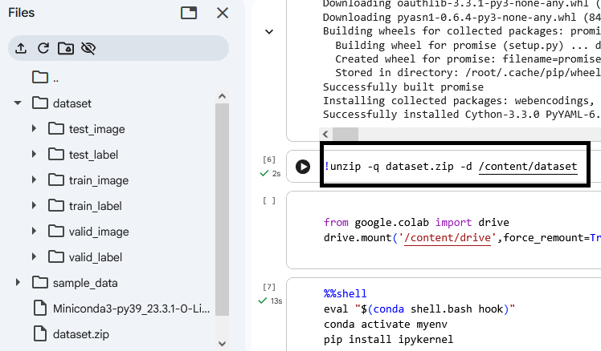
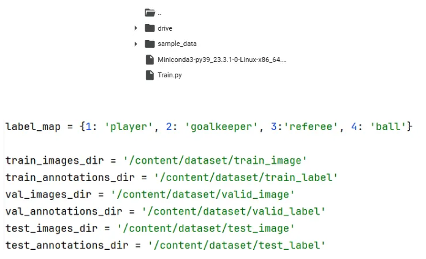
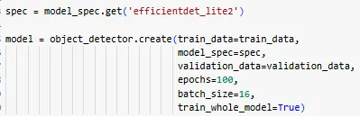

# Tflite_Model_Maker_can_work_in_Colab
Finally Tflite Model Maker can work in Colab!
How do we solve the perennial Tflite Model Maker issue? A lot of researchers was stuck when Google Colab updated to version 3.10 and yet Tflite-Model-Maker still remains at ver 3.9. 

Many researchers have tried to downgrade the Colab to version 3.9 using this command

```
!sudo apt-get install python3.9
```

but nothing works!

The solution: we need to run Google Colab at version 3.9 using virtual environment. We also need to run the training commands as a python script, not directly at the cells. 
Let’s see how does this.

## Inisialisasi
```
%env PYTHONPATH = # /env/python
```
## Get the Miniconda using the commands below
```
!wget https://repo.anaconda.com/miniconda/Miniconda3-py39_23.3.1-0-Linux-x86_64.sh
!chmod +x Miniconda3-py39_23.3.1-0-Linux-x86_64.sh
!./Miniconda3-py39_23.3.1-0-Linux-x86_64.sh -b -f -p /usr/local
!conda update conda
```
## Create a dedicated space (environment) called "myenv" and installing "Python 3.9" into it
```
import sys
sys.path.append('/usr/local/lib/python3.9/site-packages')
```
```
!conda create -n myenv python=3.9
```
## Install Tflite-model-maker in Conda env
```
%%shell
eval "$(conda shell.bash hook)"
conda activate myenv
pip install tflite-model-maker
```
## Test out with a sample dataset (link below) from Roboflow.
It is always good to test out a sample dataset before running our custom dataset. We need to manually separate into the annotation and images file — in total 6 folders
<p align="center">
   
</p>
<p align="center">
   
</p>

## Upload the train.py script
Upload the train.py (link below) to content. Remember to set the path and label_map correctly.
<p align="center">
   
</p>

### Set hyperparameters in the object detector

Select EfficientDet_lite2 with 100 epochs and batchsize 16 as a start. Do not run on batchsize 32 or 64 as you will get error due to the large memory required.

To speed up, please consider using the smallest model (efficientdet-lite0) and batchsize 16.
<p align="center">
   
</p>

## Ekstrak dataset di Colab
```
!unzip -q dataset.zip -d /content/dataset
```
## atau mount ke Google Drive
```
from google.colab import drive
drive.mount('/content/drive',force_remount=True)
```
## Installing some additional packages
```
%%shell
eval "$(conda shell.bash hook)"
conda activate myenv
pip install ipykernel
```

```
%%shell
eval "$(conda shell.bash hook)"
conda activate myenv
pip install opencv-python
python --version
```

```

%%shell
eval "$(conda shell.bash hook)"
conda activate myenv
pip install numpy==1.23.4
```

```
%%shell
eval "$(conda shell.bash hook)"
conda activate myenv
pip install pycocotools
```

```
%%shell
eval "$(conda shell.bash hook)"
conda activate myenv
pip install --upgrade matplotlib
```
## Training Script
```
%%shell
eval "$(conda shell.bash hook)"
conda activate myenv
python Train.py
```

## Finally copy the output .tflite and labels to test at Raspberry Pi.

TFLITE_FILENAME = 'trained_model.tflite'

LABELS_FILENAME = 'model-labels.txt'

## REFERENCE
- https://medium.com/@elvenkim1/finally-tflite-model-maker-can-work-in-colab-f21cd58e8524
- videoguide: https://youtu.be/Enysj0IVEno
- script: https://github.com/elvenkim1/tflite-model-maker/blob/main/Train.py
- dataset: https://universe.roboflow.com/roboflow-jvuqo/football-players-detection-3zvbc

